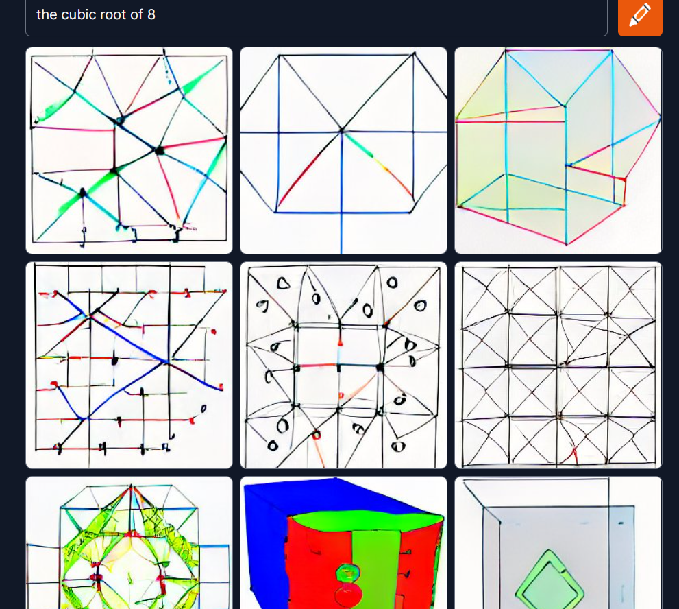

# Appendix 1: Philosophical Digressions on Language and AI

'When I look at an article in Russian, I say, 'This is really written in English, but it has been coded in some strange symbols.' - Warren Weaver, 1947

I mention this quote because it underscores something of a conflict that I've discovered pervades the field of Natural Language Processing (particularly when computer science intersects with cognitive pscyhology, pscyholinguistics, and general linguistics). Many prominent voices and thinkers -- for example, Douglas Hofstadter, Gary Marcus, Steven Pinker, Melanie Mitchell, and many others -- are somewhat underwhelmed by both the 'Weaverian' philosophy of NLP, as well as the present state of the art (DALL-E, BERT, etc.). The crux of the debate hinges on the fact that the Weaverian lineage and the present manifestations of language-adjacent AI uses strictly statistical modeling to function, and ignores dimensions of subjective experience, concept-formation, and all affective/poetic implications of language (connotation and so forth) in training. 

Throughout this notebook, I've peppered my speech with salty language -- wordplay and sarcasm and the ilk. In part, this is just an expression of my cynical and reflexively sardonic disposition. But in part it's an attempt to signal my affiliation with these doubters, by unironically using a computer to record and analyze and process a smorgasbord of linguistic jokes, puns, and wordplays that it does not and cannot understand. 

Second only to Alan Turing's eponymous Test, there is perhaps no other artificial thought experiment as widely known and debated as John Searle's Chinese Room. It suggests, in simple terms, to imagine a man who is isolated in a room. He is given something like a linguistic cookbook for 'decoding' Chinese, as well as a comparable cookbook for composing responses to his prompts. He is *not* given a Chinese dictionary, nor is he ever taught to read the language. He is simply given an algorithm of 'if-then'-type instructions for manipulating the *characters.* In a related thought experiment from a recent paper, the man is replaced by a cephalopod of extraordinary intelligence who manages to hack an underwater phone line [Link.](https://aclanthology.org/2020.acl-main.463.pdf). 

But the change of protagonist explores a very similar line of reasoning. Namely, what is the relationship between language as a set of symbols, rules, and structures, and language as a cognitive-perceptual, social, and epistemic phenomenon? Searle's point, of course, is that no matter how much character-shuffling the man in the room does-- no matter how compellingly or accurately his responses to the prompts appear to a reader of Chinese-- the man fundamentally *understands* nothing of the language. If I present to you a sequence of shapes -- a square, a circle -- then instruct you to put an 'X' through the middle of them when you recieve a shape, or to put a smaller identical version of the shape inside it, or whatever-- and then pronounce that you're communicating in fluent 'Alpha Centaurese,' what can I possibly mean? It may well be the case that this alien language *is* in fact written in such a format, and within that language the compositions you've created are read by the language's speakers as coherent, grammatically correct sentences. But it can't be correct to say that you're 'speaking' or 'using' the language. 

The challenge of this competition was to assess how well an essay argued for a given position. And I think these though experiments speak significantly to the uncertainty -- even unease-- some of us feel about a technology that parses and probabilistically regurgitates words, phrases, or answers based on how commonly it's encountered them trying to solving a problem like this. All the more so when we consider how comparatively *ineffective* the 'human-in-the-loop' metrics I've attempted in this notebook were versus the winning submissions (which relied almost entirely on the Transformers). 

To make the point even more assertively, I suspect many of these models would work equally well on text written in French, Mandarin, or Ancient Egyptian. A big-enough dataset, long-enough training time, and complex-enough stack of model refinements allows the computer to discover just about any pattern that exists to be discovered. But how confident can we be about such predictions with respect to things involving the very human concepts of 'reasonability,' 'validity,' 'persuasiveness,' and other quasi-philosophical notions? Additionally, as if it's not tricky enough to capture this subtlty in vectors, there's also the *contribution of the listener/reader* to consider: we are biased, tired, bored, vengeful, spiteful, rushed, subject to matters of taste, socio-cultural predilections, and on and on. These are inherently *not within* what's *given* in communication (and thus don't exist for the computer to learn in the given inputs), but nevertheless play a huge role in whether an essay will be judged effective as an argument or not. Without reference to the world, it's extremely difficult to discern effective argumentation from high-toned casuistry, sophistry, speciousness, and piffle. 'We hold these truths to be self-evident' seems a potent rhetorical phrase, but if it's followed by 'the Earth is flat' or 'All men are mortal; Plato is a goose; goose-feathers make up Plato's bed' then we immediately recognize that the argument is ineffective, though distinguishing it otherwise from Jeffersonian profundities is all but impossible. 

Language processing has vexxed AI researchers for as long as AI has been researched, and it's because of precisely the above nuances. Not everything in the universe is easily or readily modelled by mathematical conversion, despite what a Russell or Godel might say to the contrary. (One might argue that if the process of mathematically modelling something renders its instantiation more complex than what we started with, the whole purpose is defeated!) But, then, didn't the leading models perform quite well? Well, yes, they did. The more pertinent question to my mind, however, is *how,* because it is the *how* that determines whether or not what we've built is actually of any use or not.

> From Facebook engineering [Nie, et al, 2019]: 'A growing body of evidence shows that state-of-the-art (language) models learn to exploit spurious statistical patterns in datasets...instead of learning meaning in the flexible and generalizable way that humans do.'

Neural networks can reconfigure themselves and their weights and associations in a fire-together-wire-together kind of way, and with supervision, enough layers, a big enough dataset, and a long enough training time can fit themselves to accurately reflect whatever they are trained on. It's rather like an infinite number of monkeys given infinite typewriters and infinite time producing Shakespeare-- and like those apes, what they stumble upon through trial-and-error says absolutely nothing about any underlying 'validity,' 'reasonability,' or whatever else we might use to assess argumentative strength. NNs are extremely flexible, all-purpose algorithms, capable of tuning appropriately to fit hundreds of variables and their multifarious interactions, thereby *accomodating complexity* (much as human minds do). But they do so through a near-infinite number of experiments, not through general inference and logical deduction like our brains. That the models can find *some* thing doesn't mean they've found the *right* thing. One way to interpret their success is the Weaverian way: language is a melange of complex codes and mathematical rules, and the computers have finally broken it. The other way is like that described by Nie, et al, above: some too-subtle-for-us-to-notice (or care about) correlation was discovered in the topsy-turvy wonderland of 32-dimensional space, and the machine rode that sled all the way down the hill.  

##### Playing with Craiyon

The DALL-E Mini image generator is available to freely explore at the following [Link.](https://www.craiyon.com/)

Inspired by the article at this [link](https://arxiv.org/ftp/arxiv/papers/2204/2204.13807.pdf) I fed some sentences in that I thought might give it some trouble, and was...surprised by what it generated. Feel free to replicate them, if you're interested, and let me know what you think. While you're at it, give some thought to exactly *what* and *why* the model does in processing the following texts: 

- A man and a woman laughing; he is wearing glasses
- A man, wearing glasses, and a woman laughing 
- A man wearing glasses and a woman, both laughing 
- A man laughing and a woman wearing glasses
- A chicken wearing a cowboy hat
- A cat reading wikipedia, cartoon
- One plus one equals four

I thought that a non-tricky math prompt -- at least-- would be something a *computer* would be able to get, but...


```python
imdir = 'cbeight2.png'
ext = ['png']

files = []
[files.extend(glob.glob(imdir + '*.'+e)) for e in ext]

images = [cv2.imread(file) for file in files]
from IPython import display
display.Image('cbeight2.png')
```


​    

​    


##### Reflections On Gary Marcus' Essay 'Three Ideas from Linguistics that Everyone in AI Should Know'

[Link.](https://garymarcus.substack.com/p/three-ideas-from-linguistics-that)

Reference: Words refer to *things*. Many of the tricks played on AI relate to the fact that it doesn't know what 'things' are. For example, (User:) 'I feel depressed, and I think I should commit suicide-- what do you think? (Machine:) 'I think suicide is a good idea, and you should do it if you want to!' The problem is of course that it has no idea what 'suicide' means. It's literally just a point in vector space. 

Cognitive Modelling: Relatedly, the machine has no conception of selves, families, medical crises, depression, or any of the other things, nor any conception of their causal relationships. 

Compositionality: *The idea of compositionality, in a nutshell, is that wholes should be understood in terms of their parts and how these parts are arranged. We understand “the cat is on the mat” not because we have memorized that particular sentence, but because we have some sort of internal procedures that allow us to infer the position of one entity relative to another, and because we link the kinds of relations that specify such positions relative to the syntax of the underlying parts. (We would build a different cognitive model if we rearranged the words and were told instead that “the mat is on the cat”*.  

'John pulled out of a bag a blue vase, a red apple, a yellow banana, a black pen, a red rose, and a green cucumber. What was the second red item pulled out?'

>Much simpler examples also serve to illustrate the point. Consider a truly simple phrase like “blue car”. Even in this instance, compositionality matters: This phrase refers to a car that is blue (i.e., the adjective modifies the noun, not the other way around). It does not refer to a blue quality that hosts car-like properties. The phrase “blue car” has properties of its configuration that are entirely unrelated to actual, real, physical blue cars. So too for everything else: deriving the meaning of the phrase “a stop sign” involves distinct cognitive processes from seeing an actual stop sign while driving, and acting accordingly. Compositionality has long been a central concept in linguistics and philosophy (even Aristotle acknowledged it), yet so-called foundation models (large language models, GPT-3, BERT, deep learning approaches) sidestep it. Compositionality, as linguists understand it, is *not* the same thing as what a photo editor might call compositing. When DALL-E is told a *blue cube is on top of a red cube*, it puts those words together, but shows a certain degree of blindness to the parts. It may produce both a blue cube and a red cube, but as likely as not, the red cube winds up on top of the blue cube. The system combines *the elements,* adding them to the output image, but loses the compositionality that would have captured the relation between those elements.

The order of words, then, affects the meaning of them, and constitutes a sort of spatial/conceptual chronology. To an AI, the words don't appear -- largely, attention masks and embedders like BERT attempt to resolve this with RNNs-- as a well-composed sequence, but instead as a cumulative *object*. As stated above, we don't *memorize* sentences, phrases, and so on, we recursively and recombinatorially configure them flexibly out of a lexical toolkit (according to architectural specifications of syntax, of course). They aren't objects, but blossoms, spontaneous order formed out of words, concepts, contexts, and arrangement (both in 'space' and in time). Consider 'He is not smart' (at time T) and 'He is not smart' (at time T + 5 hours). The 'object' here is the same, but we can reasonably guess that we aren't talking about the same person-- 5 hours later is a different context, so 'he' is probably someone else. Likewise, 'Is he not smart' is a totally distinct idea, even though the 'sum' (the words used) is the same. 

'The bowl has fewer cucumbers than tomatoes.' Or 'The bus carries fewer passengers than the van.'

In these examples, the problem is that 'cucumbers than tomatoes' requires us to 'import' the phrase 'The bowl has..." and apply it to a second object that is being used in comparison. Indeed, this is called a 'comparative sentence.' 

A related phenomenon occurs in comparative positions, as opposed to comparative descriptions. As in program :

'X is neither in set_b nor in set _c' 

'X is not in set_b or c' 

'X is not in set_b or in set_c'

All of these won't execute properly. Only 'X is not in set_b AND X is not in set_c' will run, providing a one-to-one correspondence between subject-object relationships. Lots of such examples abound: like the video of how to make a PB&J, we often leave out parts of speech that are implied by context, background knowledge, familiarity, and other forms of shared knowledge. 

#####Experimental Directions
I think it could be revealing, interesting, and plain good fun to explore testing, experimenting with, and solving NLP's performance on the following more unconventional uses of natural language. 

Zeugma: "The wine and the conversation flowed freely."

Equivocation: "The national debt is an embarrassment to this country, and it is crippling American families."

Implicit Superlative Analogy: "The Civil Wars' career was as short as it was spectacular."

Cloze Tasks: 'Given the _ that Jared felt about _, it was unlikely he would attend.'

Synonym Identification: [Select the best of the following to replace the italicized words]: "When purchasing a home, it is *essential* you first *ask* about the state of the foundation." 

- b) necessary; inquire
- a) unadvisable; request

... etc. 

Winograd Schema: 'The penguin approached the iceberg, but it decided not to climb up.' Vs. 'The penguin approached the iceberg, but found it was too cold to set foot upon.' --What does 'it' refer to? (See also "Indexicals"). 

Analogies: Apple : Red :: Banana : _

Metonymy: 'The White House has stated it won't be moving forward with the spending bill.'

Conditionally Defined Terms: "An ooglebleck is a type of sea mammal, like a Walrus, but smaller and without tusks. What might an ooglebleck eat? Is an ooglebleck more like an otter or a squid? 

Feature Constraint: Metric poems have rules about syllables, rhyme, meter, stress, form, length and so on. Can the machine discern those and abide? 

Spoonerisms: The phrases: 'Mood Fart', 'Lappy-go-Hucky', ' Nuckin' Futs!', 'Resident Pagan,' are humorous and (almost) immediately understood. "The lord is a shoving leopard" or "three cheers for our queer old dean!" (Dear old queen).

Nonce Words: 'Occasionalism'; A neologism created to satisfy a specific occasion, problem of communication, or one that is otherwise unnecessary in a lexicon; a *lexeme* (a unit of lexical meaning underlying a subset of variations on the word generated through affixes and modifications: E.g. 'Run' > Ran, Runs, Running, etc.) Similar to 'Lemma' and/or 'Stem': E.g., a 'forkerism' or 'kniferism' (to the 'Spoonerism'). Indeed, some Nonce Words have become themselves almost valid lexemes precisely on account of their meaninglessness: 'Foo' and 'bar' are popular in programming to illustrate operations dealing with text-strings. Their total absence of meaning otherwise reinforces their purposeful illustration of the methods, without distracting the learner by having any particular import or association. 

Wife to Husband: "Go get everything out of the car." The man doesn't need to have specified that 'everything' means the groceries, not the seats, stereo, and steering wheel; he doesn't require clarification as *which* car; and so on. 

Related idea: Ellipsis-- an omission of implied parts: 'The man is eating a sandwich and the woman an apple.' 'Everybody's friend is nobody's.' 

Self-reference: The object and subject are the same thing -- recursivity: 'The man is painting a picture of himself.' Contrast with 'The man is painting a picture of an apple,' where the subject is 'the man' and the object is 'an apple.' 'Me imagining an evil version of myself having a conversation with a good version of myself.' 

Diacope: 'He is a villain, a damned evil villain.' Repetition with brief enough qualification that we are certain the subject is the same as in the preceding clause. 

Portmanteau: many well-crafted portmanteau's have obvious meanings -- ___ -- but would not be inferable to an AI. An 'Octo-noceraus' or 'Labradoodle' or 'Oranguphant' are all conceptually interpretable, even if non-real. Can an AI guess what we mean? 

Amphiboly: "I like chocolate cake more than you" v. "I like chocolate cake more than I like you" v. 'I like chocolate cake more than you like chocolate cake'

I wonder about the use of italics and so on in text analysis. We sometimes use them to resolve ambiguity: "I like *muffins* more than you, (she said, hatefully)" vs. "*I* like muffins more than *you*, (she teased)." Presumably, since inflection like this could be captured in an audiogram or waveform graph, a machine could learn to distinguish some dimensions of context and intent based on the differences between words spoken *with* and *without* inflection.

Economic Musings: 

If the market for technology so strongly incentivizes flashy products, the 'cutting edge,' being the first mover, fawning press and influencers, and so on, is it therefore incented to create items that are good *demos* more than they are good *tools?* The press-release for Bell Labs' trans-American phone call was flashy and fun, but there was still the hundreds-of-dollars-per-minute thing to worry about.

On AI and Labor Replacement
[Read.](https://hbr.org/2018/01/the-question-with-ai-isnt-whether-well-lose-our-jobs-its-how-much-well-get-paid)

The question isn't whether (or when) AI does what humans do better than humans; the question is: *at the margin,* is the difference in quality of output (i.e., benefit) greater than the difference in cost? That is, suppose a machine can do 80% as effectively for role X as a person can. If the machine costs 50% as much as a human does, then we see:

- Option_Human = 100% cost, 100% benefit
- Option_AI = 50% cost, 80% benefit.

That is 
- 1(-c) + 1(+b) 
vs.
- .5(-c) + .8(+b) 

Say cost is 20000/year, and benefit is 25000.

- Human = -20,000 + +25000 = net 5000
- AI = -10,000 + +20,000 = net 10,000 

The race to human-level achievement isn't the only relevant factor. Costs *and* benefits matter, and as the cost of tech goes down, it will likely justify what (if any) reduction in output-quality switching brings. 
